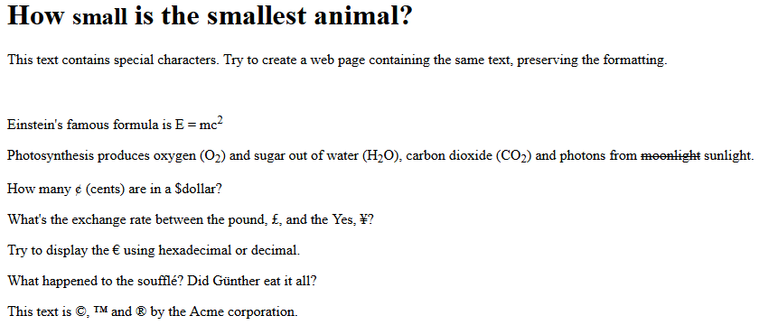

<<<<<<< HEAD
# prueba
=======
# Web Lab &ndash; HTML
In this lab, we'll begin our coverage of HTML. We'll also start getting practice with `git` and `GitHub Classroom`, for managing your codebase.

- This is my change!  

New Change in the new branch!5


## Obtaining the code
Now that you've obtained a copy of this repository through GitHub Classroom's invite, you have your own private version of this repository (i.e. the one you're looking at now)! To clone this repository onto your machine, click the green `Code` button, make sure `HTTPS` is selected, then click the `copy` button to the right of the web URL to copy its value. Then, clone onto your local machine from a terminal, using the `git clone` command.

If this is the first time you've ever cloned a repository on the current machine, you may be asked to enter your GitHub credentials. The "sign in with your browser" option should work just fine. You may need to enter your GitHub username and password, and / or authorize "git credential manager" to access your account. Perform these steps if asked.

Now, you should have a clone of your repository on your local machine, ready to develop!

Remember to commit and push your work regularly for backup purposes.

**You'll see step-by-step instructions for how to do this in Exercise One below - but you should follow these steps for all exercises in this and future labs.**

Explore the files in the project, familiarizing yourself with the content. Open the project in Visual Studio Code by right-clicking the lab folder and selecting *"Open with Code"* (or, if this option is not available, you may open VS code and select *"File"* ➡ *"Open Folder"*).


## Exercise One &ndash; HTML files & making changes
**Note:** This exercise's `git` instructions refer to the command line / terminal. You are also welcom to use Visual Studio Code's built-in `git` integrations to accomplish the same functionality. For reference, please see [this site](https://code.visualstudio.com/docs/editor/versioncontrol) or consult the provided video recordings on Canvas.

### B) Investigating the code
Navigate to the [`ex01`](./exercises/ex01) folder within the project and open the [`exercise01.html`](./exercises/ex01/exercise01.html) file. Read through the content of the document, particularly noting the HTML markup.

Next, we'll open this file in a browser. If you right-click the file in VS code, and select *"Reveal in File Explorer"*, a file explorer window will open allowing you to see the file. Double-clicking the file will open it in your system's default browser.

You may also open the browser preview from within VS code. To do this, download the [HTML Preview extension](https://marketplace.visualstudio.com/items?itemName=george-alisson.html-preview-vscode) for VS Code. You may do this by clicking the link here and clicking the *"Install"* button.

Once installed, you may then right-click on any HTML file from within VS code, and choose *"Show in Browser"* to automatically open the file in your system's default browser.

### C) Making changes
Once you've made sure you can open `exercise01.html` both in your editor and a browser, make a change to the file. This can be anything you like - perhaps adding a new heading (`<h1>`, `<h2>`, etc) or paragraph (`<p>`). Once you've made the change, save the file and view the modified web page in your browser (if you still have it open from before, hit the browser's *"refresh"* button).

### D) Committing and pushing changes
Now that we've made changes, we want to *commit* them. Creating a commit will store a version of the code as it is at that point. 

Run the following commands to create a commit:

```bash
git add .
git commit -m "Modified exercise01.html"
```

The first command (`git add`) *stages* your changes, so they're ready to be committed. The second command actually commits them to the current branch (which should be `main` in this case).

Next, we want to *push* our changes to our remote GitHub repository. To do this, run the following command:

```bash
git push -u origin main
```

This command pushes `main` to GitHub.

You may wish to open your repository in GitHub and check if your commited changes have been successfully pushed from your local Git repository on your computer to your remote repository in GitHub.

This is a very simplified workflow that assumes that you are working on a branch called `main`. In some Git repositories you may find that the primary branch is named `master` rather than `main`. When you begin working with more complex Git workflows for collaborating with others, you will often start using separate branches other than `main` for different features and/or different collaborators.

## Exercise Two &ndash; Browser forgiveness
**For this and all remaining exercises, remember to practice git branching, committing, and PRs using the steps in Exercise One!**

Using your IDE (e.g. VS Code), open the [`exercise02.html`](./exercises/ex02/exercise02.html) file. Preview this file in your browser, and take a look at the HTML code. The web page has purposely been written to be self-documenting, so the page displayed details what the problems are in the HTML syntax used to produce the page.  Read through the displayed page, then return to your IDE and read through the HTML in the document.

Visit the [w3c HTML validator](https://validator.w3.org/) and click on *"Validate by File Upload"*. Upload the `exercise02.html` file to check if it validates. It shouldn't. Scroll down, and read the report that is generated, detailing the problem. You will see details reported about a lack of a character encoding, difficulty determining which parsing module to use (due to it not being able to tell which version of HTML is being used), and errors concerning how some of the tags have been written.


## Exercise Three &ndash; Cleaning up HTML
**For this and all remaining exercises, remember to practice git branching, committing, and PRs using the steps in Exercise One!**

Continuing on from Exercise Two, modify `exercise02.html` to correct the issues identified in the previous exercise/ These will include:

- Adding a doctype declaration
- Indicating the character encoding
- Closing unclosed HTML tags
- Correcting the nesting of tags
- Lower-casing the tags used in the document

Using the validator and method from the previous exercise, validate your new document. When the validator indicates that there are no problems, you are done.


## Exercise Four &ndash; Interesting web pages
**For this and all remaining exercises, remember to practice git branching, committing, and PRs using the steps in Exercise One!**

In this exercise we focus on developing more interesting content where you will create two web pages, each about a historically famous New Zealander. 

In the [`ex04`](./exercises/ex04) folder, you will find two text files which contain unformatted content that you will transform into web pages. You will also find one file html file that we have created for you - you will need to create the other one yourself. Begin by copying the contents of the appropriate text file into the `<body>` of the corresponding html file, then ensure that:

- Paragraphs of text are appropriately tagged
- The title element of the page is correctly set to the name of the famous person
- Headers are set with the Page header being the largest, major sections title being slightly smaller and subsections being smaller again
- Separate major sections using horizontal rules (`<hr>`)
- Wikipedia citation marks ([8], [citation needed], etc) elements are removed from the text.


## Exercise Five &ndash; Formatting
**For this and all remaining exercises, remember to practice git branching, committing, and PRs using the steps in Exercise One!**

In the [`ex05`](./exercises/ex05) folder, you will find two text files which contain unformatted content in the form of recipes that you will transform into web pages. This time, we have not provided any HTML files for you, you will need to create them.

To complete this exercise, you will need to:
- Create two appropriately named HTML files - One for each recipe
- Copy the plain-text recipes into their respective HTML files
- Format the recipes using HTML such that
  - The title of the recipe is shown as a large heading
  - The Ingredients and Method are shown as smaller headings
  - There is a horizontal line separating each section
  - Ingredients are displayed using an unordered list
    - Quantities of ingredients should be highlighted as important
  - Method should be shown as an ordered list
    - Verbs such as **bake** and **mix** should be emphasised

Make sure you preview your pages regularly in your browser, to ensure your HTML code is behaving as expected.


## Exercise Six &ndash; Special characters
**For this and all remaining exercises, remember to practice git branching, committing, and PRs using the steps in Exercise One!**

In [`exercise06.html`](./exercises/ex06/exercise06.html), recreate the text pictured below as accurately as possible, using appropriate HTML tags and HTML entities.



Make sure you preview your page regularly in your browser, to ensure your HTML code is behaving as expected.
>>>>>>> master
